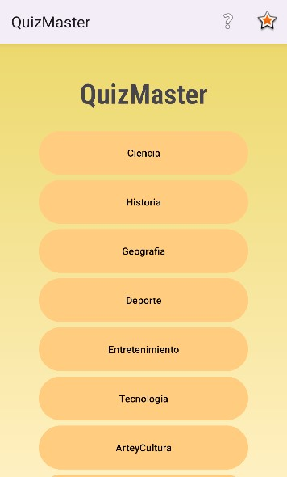
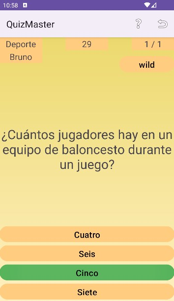
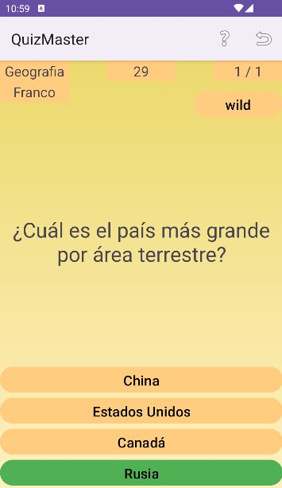

# QuizMaster

## Overview

QuizMaster is a Kotlin-based project developed as part of a university assignment. This app offers an engaging way to test your knowledge across various categories and compete for a spot on the leaderboard included in the app.

## Features

- **Multiple Categories:** Choose from a variety of trivia categories to challenge yourself on different topics.
- **Ranking System:** Track your progress and see how you rank against other players.
- **Wild Card Function:** Use a wild card to skip the current question if you cannot think of the right answer.

## Getting Started

### Prerequisites

- [Android Studio](https://developer.android.com/studio)
- [Kotlin](https://kotlinlang.org/)

### Installation

1. Clone the repository:
   ```bash
   git clone https://github.com/brunoeliam/quiz-master.git
   ```
2. Open the project in Android Studio.
3. Build and run the app on an emulator or an Android physical device.

## Usage

1. Launch the app.
2. Select a trivia category.
3. Answer the questions to test your knowledge on the topic you chose.
4. Check your ranking on the leaderboard.

## Screenshots

 




## Contributing

If you would like to contribute to this project, please follow these steps:

1. Fork the repository.
2. Create a new branch (`git checkout -b feature-branch`).
3. Make your changes.
4. Commit your changes (`git commit -m 'Add some feature'`).
5. Push to the branch (`git push origin feature-branch`).
6. Open a pull request.

## Acknowledgements
- Special thanks to my classmate (https://github.com/Frannogueda) for his support and help while developing this project together.
